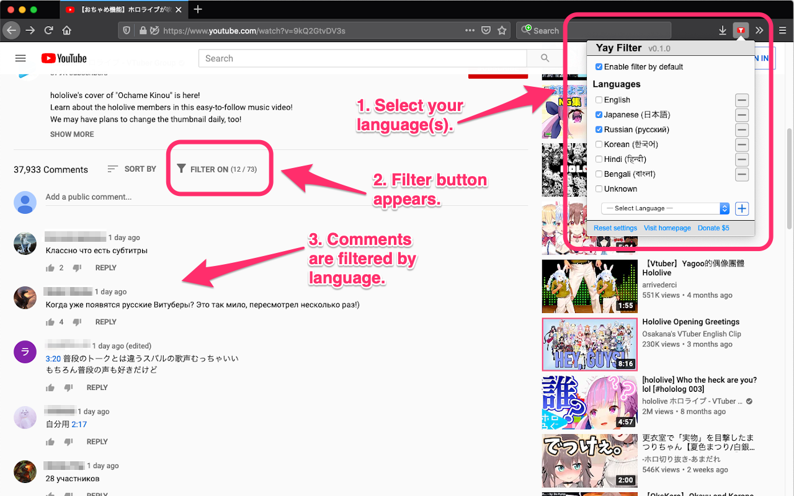

# Yet Another YouTube Comment Filter (Yay Filter)

## Get the Extension

TBD

## Features

This extension provides a comment filter on [YouTube](https://www.youtube.com/).

-   Language Filter
    -   You can configure the languages you want to see.
-   Filter On/Off Button
    -   You can turn on/off the filter for each tab.

## Requirements

-   Device: Desktop only
-   Browser:
    -   Firefox (Recommended): version 54 or later
    -   Google Chrome: version 57 or later

Note: This extension uses a browser's internal Compact Language Detector (CLD). Filters may perform differently with different browser versions.

## Privacy

Privacy matters.

-   This extension does not access any external resources.
-   This extension accesses the browser's Local Storage to save and load your settings.

## Contribution

-   [Report an Issue](https://github.com/mogproject/yay-filter/issues)
-   [Developers Guide](https://github.com/mogproject/yay-filter/wiki/Developers-Guide)

## Special Thanks

This project was inspired by [YouTube Comment Language Filter](https://github.com/anaclumos/youtube-comment-language-filter).
